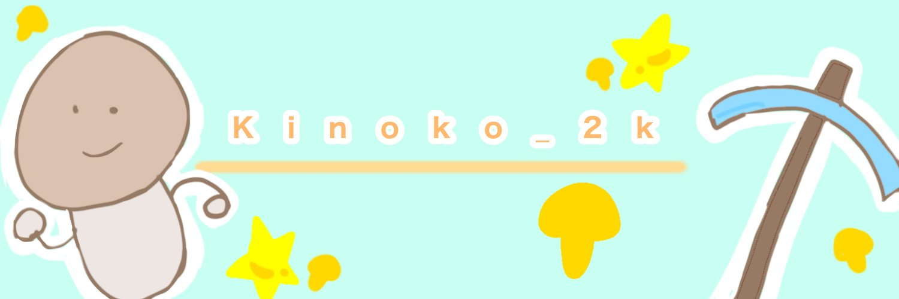

 

## ✨自己紹介
大学生になりました。 
[**no+e**](https://note.com/kinoko1216)でDiscordやMinecraftの記事を書き続けてる人です。 
開発物と言えるようなものはありませんので、どちらかというと開発物にドキュメント記述やプログラムのバグ発見のほうができます。 
Markdownによるドキュメント作成、Wikiの作成なのが趣味です。 
書けるものと言えば、Python、Java、日本語です。 
規模は小規模でしたが、マイクラサーバー『きのこサーバー1』を運営してました。 

## ✅所属グループ
・[KinokoNetWork - KinokoServer2](https://seesaawiki.jp/kinokoserver2/) (MinecraftServer - Owner) - 4月1日~4月13日まで活動休止 
・[ArukaNetwork](https://disboard.org/ja/server/1168232472287395880) (MinecraftServer - Moderator) 

[etc...](<https://github.com/kinoko2k/kinoko2k/blob/main/History.md>)

## 📝note記事 - 新しい順
<!-- BLOG-POST-LIST:START -->
- [Discordのイースター？イベント『The Last Meadow』についてまとめたもの](https://note.com/kinoko1216/n/n5f8a437d4e1d)
- [受験→合格→趣味→大学準備などやっ...](https://note.com/kinoko1216/n/n551b5c8f26ab)
- [名古屋市科学館です。大きいプラネタリウムは教科書に載ってるはず…](https://note.com/kinoko1216/n/n2195b595d052)
- [[Discord]ブロックとは違う無視機能が追加！](https://note.com/kinoko1216/n/n9b9f1dc0fd8b)
- [難しいけど、かっこいいリズムゲーム「Adofai」をやりませんか？](https://note.com/kinoko1216/n/na9c112614328)
<!-- BLOG-POST-LIST:END -->

# 🍨アカウント
| name | id |
| --- | --- |
| X | [@kinoko1216](https://twitter.com/kinoko1216/) |
| Discord | [@kinoko1216](https://discord.com/users/925245386568896564) |
| GitHub | [@kinoko2k](https://github.com/kinoko2k) |
| MCID | [Kinoko_2K](https://ja.namemc.com/profile/Kinoko_2K.1) |
| note | [@kinoko1216](https://note.com/kinoko1216) |
| stats.fm | [@omuraisu](https://web.stats.fm/omuraisu) |
| BookMeter | [@panda](https://bookmeter.com/users/1402914) |

<!--  -->

<picture>
  <source media="(prefers-color-scheme: dark)" srcset="https://raw.githubusercontent.com/kinoko2k/kinoko2k/main/img/snake-dark.svg">
  <source media="(prefers-color-scheme: light)" srcset="https://raw.githubusercontent.com/kinoko2k/kinoko2k/main/img/snake.svg">
  
</picture>

 
<blockquote class="twitter-tweet">
プロフカード <a href="https://t.co/rzthNPc9Mq">pic.twitter.com/rzthNPc9Mq</a>
&mdash; きのこ (@kinoko1216) <a href="https://twitter.com/kinoko1216/status/1819635409107951809?ref_src=twsrc%5Etfw">August 3, 2024</a></blockquote> 
<!--  -->
 

 

<!-- ・MinecraftId:[`Kinoko_2K`](https://ja.namemc.com/profile/Kinoko_2K) 
<li><a href="https://note.com/kinoko1216">note.com@kinoko1216<a> 
Hello World
-->

<!--
## 📝主な記事
- [no+e@kinoko1216](https://note.com/kinoko1216)
    - [Discordの新機能の「投票」が追加された！ - kinoko2k](https://note.com/kinoko1216/n/n78b37bd3b50d)
    - [[Discord]Clipをうまく利用していい動画を残そう！ - kinoko2k](https://note.com/kinoko1216/n/nb1da602f0969)
- 翻訳
    - [BedWars](https://www.spigotmc.org/resources/screaming-bedwars-1-8-8-1-20-4.63714/update?update=493428)
    - [ChatEX](https://github.com/TheJeterLP/ChatEx/pull/146)
- ドキュメント記述
    - [Discord-SimpleMusicBot](https://github.com/mtripg6666tdr/Discord-SimpleMusicBot)
## ⚙️技術・使用
<!-- https://suzukikatsuma.github.io/badge-generator/ -->
<!--
## ステータス

-->

<!--

-->
<!-- ![Metrics](https://metrics.lecoq.io/kinoko2k?template=classic&isocalendar=1&languages=1&achievements=1&repositories=1&activity=1&base=header%2C%20activity%2C%20community%2C%20repositories%2C%20metadata&base.indepth=false&base.hireable=false&base.skip=false&repositories.batch=100&repositories.forks=false&repositories.affiliations=owner&isocalendar=false&isocalendar.duration=half-year&languages=false&languages.ignored=html%2Ccss%2Cjava%2Cjavascript%2Cmarkdown&languages.limit=8&languages.threshold=0%25&languages.other=false&languages.colors=github&languages.sections=most-used&languages.indepth=false&languages.analysis.timeout=15&languages.analysis.timeout.repositories=7.5&languages.categories=markup%2C%20programming&languages.recent.categories=markup%2C%20programming&languages.recent.load=300&languages.recent.days=14&repositories=false&repositories.featured=KinokoServer%2Fdocuments%2CJankenWeb%2CPunishment-Program%2CSentenceGenerator&repositories.pinned=0&repositories.starred=0&repositories.random=0&repositories.order=featured%2C%20pinned%2C%20starred%2C%20random&achievements=false&achievements.threshold=C&achievements.secrets=true&achievements.display=detailed&achievements.limit=5&activity=false&activity.limit=5&activity.load=300&activity.days=14&activity.visibility=all&activity.timestamps=false&activity.filter=all&config.timezone=Asia%2FTokyo) -->
<!--  -->
<!--  -->

<!-- 1 -->
