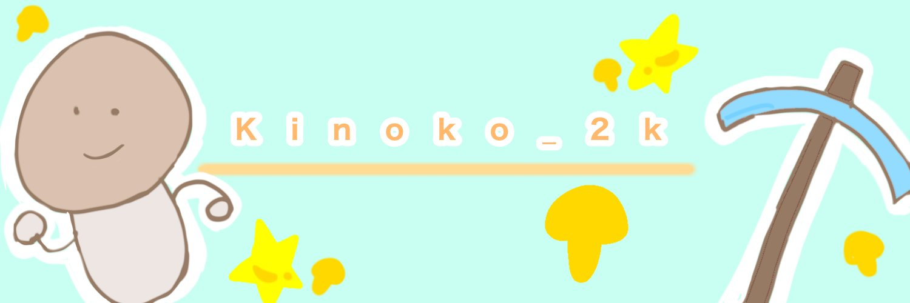

 

<!--  -->

## ✅Works
- [GitHub｜kinoko2k/fxtwitterChangeBot](https://github.com/kinoko2k/fxtwitterChangeBot)
- [note/Discordの新機能の「投票」が追加された！](https://note.com/kinoko1216/n/n78b37bd3b50d)
- [note/[Discord]VCなしでも友達とアクティビティをプレイしよう！](https://note.com/kinoko1216/n/nbf6ba5ef97cc)
- [note/Minecraftの有名なサーバーソフトの違い](https://note.com/kinoko1216/n/nc627dbd2bc7a)

# 🍨Accounts
| name | id |
| --- | --- |
| X | [@kinoko1216](https://twitter.com/kinoko1216/) |
| Discord | [@kinoko1216](https://discord.com/users/925245386568896564) |
| GitHub | [@kinoko2k](https://github.com/kinoko2k) |
| note | [@kinoko1216](https://note.com/kinoko1216) |

<picture>
  <source media="(prefers-color-scheme: dark)" srcset="https://raw.githubusercontent.com/kinoko2k/kinoko2k/main/img/snake-dark.svg">
  <source media="(prefers-color-scheme: light)" srcset="https://raw.githubusercontent.com/kinoko2k/kinoko2k/main/img/snake.svg">
  
</picture>

 

 

<!-- ![Metrics](https://metrics.lecoq.io/kinoko2k?template=classic&isocalendar=1&languages=1&achievements=1&repositories=1&activity=1&base=header%2C%20activity%2C%20community%2C%20repositories%2C%20metadata&base.indepth=false&base.hireable=false&base.skip=false&repositories.batch=100&repositories.forks=false&repositories.affiliations=owner&isocalendar=false&isocalendar.duration=half-year&languages=false&languages.ignored=html%2Ccss%2Cjava%2Cjavascript%2Cmarkdown&languages.limit=8&languages.threshold=0%25&languages.other=false&languages.colors=github&languages.sections=most-used&languages.indepth=false&languages.analysis.timeout=15&languages.analysis.timeout.repositories=7.5&languages.categories=markup%2C%20programming&languages.recent.categories=markup%2C%20programming&languages.recent.load=300&languages.recent.days=14&repositories=false&repositories.featured=KinokoServer%2Fdocuments%2CJankenWeb%2CPunishment-Program%2CSentenceGenerator&repositories.pinned=0&repositories.starred=0&repositories.random=0&repositories.order=featured%2C%20pinned%2C%20starred%2C%20random&achievements=false&achievements.threshold=C&achievements.secrets=true&achievements.display=detailed&achievements.limit=5&activity=false&activity.limit=5&activity.load=300&activity.days=14&activity.visibility=all&activity.timestamps=false&activity.filter=all&config.timezone=Asia%2FTokyo) -->
<!--  -->
<!--  -->

<!-- 2 -->
